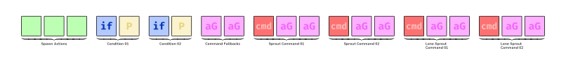
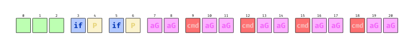
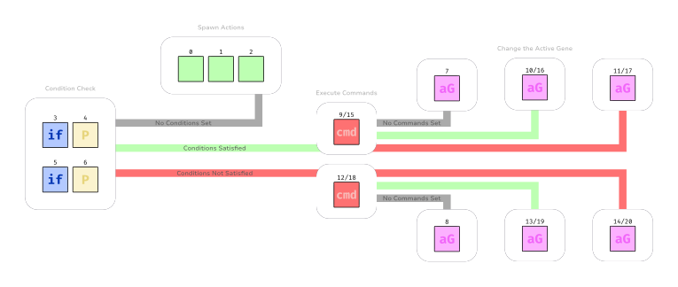
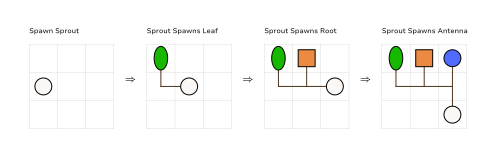

# Simulation Details

In this section, we will discuss the different cell types and their roles in the simulation.

Briefly, there are 6 kinds of cells:

- Sprout
- Leaf
- Root
- Branch
- Antenna
- Seed

We will cover each cell in its own section.

Also, we have several environmental energy resources:

- Sunlight
- Organic matter
- Electrical charge

## The Genome

The following shows the structure of one of the 52 genes composing of a genome.

## Genome Actions

The genome controls how sprout and seed cells behave.

- The spawn action block indicates what cells should be spawned in the left, forward, and
  rightwards positions. This block is executed only if no conditions blocks are present.
- Condition blocks are used to direct the flow of behaviour. If both of the given
  predicates are true, then a command block is executed (there are separate blocks for
  sprouts and seeds). Similarly, if either yield false, there is a command block that
  executes in that case.
- Commands perform an action (hence there are separate blocks for sprouts and
  lone/disconnected sprouts). Depending on whether the command is not present, whether it
  cannot be completed, or if it completed successfully, a next active gene is set.
- The active gene is simply the index of a gene in the full genome.

Together, these features control the expressiveness of the system. Below is a
demonstration of a sprout cell spawning new sprouts in its facing direction/to its right,
and spawning leaf, root, and antenna cells to its left.

