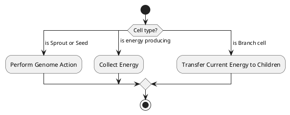
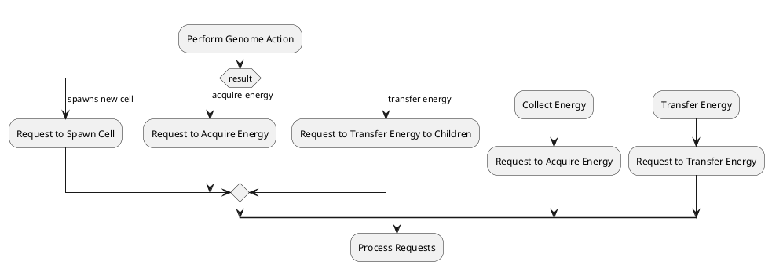

# Cells

Cells each contribute a behaviour to an organism. It may collect a particular
kind of energy, or it might produce additional cells. Together, the interaction
of cells within an organism (and between organisms) is what produces complex
systems.

In this section, we will go into the details of each cell, and its role within
the organism.

## Cell Types

### Sprout

Sprouts are one of the two cell types whose behaviour is directly influenced by
a genome. As the simulation progresses, the geneome undergoes random mutations.
These mutations adjust the behaviour of cells.

The idea is simple: when a genome produces complex behaviours to the
environment (or to other cells), the system approaches a kind of equilibrium.
If a simulation is stable, cells are able to survive indefinitely. In such
cases, and one random mutation is unlikely to destabalise the entire system.
Thus, unuseful, random mutations rarely contribute to the overall system. It is
only when many mutations are collectively considered that destablising
behaviours may emerge (ideally).

More details regarding the genome and how it effects cells can be found in the [genome]() section.

### Leaf

Leaf cells collect energy via photosynthesis. Simply, it produces an amount of
energy that is proportional to the amount of sunlight at its position.

### Root

Root cells collect organic energy from the environment. It is the only cell
that is not effected by toxic levels of organic matter.

### Antenna

Antenna cells collect electrical charge from the environment. It is the only
cell that is not effected by toxic levels of charge energy.

### Branch

Branch cells transfer energy between cells within the same organism.

### Seed

Seeds are the second type of cell whose behaviour is determined by the cell genome.

## Behaviour

Cell behaviour roughly boils down to whether it is a genome-executing cell (a `Sprout` or
`Seed`), a energy producing cell (`Leaf`, `Root`, or `Antenna`), or a `Branch` cell.

Since we are using an ECS, any system that mutably accesses components will not be
parallelisable. Additionally, in order to enforce that all cells have fair chance, we want
to be certain that actions are performed in a certain order, and done so fairly. For
example, if a cell wants to acquire energy from a cell to its left, which happens to be
where a root cell is collecting energy, both cells should be given only half the energy
each, where any remainder is left in the environment.

Because of this, a we are required to publish "requests", which can then be processed and
applied later on. This way, all requesting actions can access cells immutable and in
parallel, and then responding systems that apply these request can implement any kind of
logic to ensure fairness (such as dividing energy evenly).

By doing this, the processing of requests can also potentially be parallelised.

The general idea overall is that ECS allows you to query the current state as read-only,
and then publish your intended action without yet executing the task. Once all requests
are made, the requests can be processed as necessary, either in order or potentially in
parallel.
