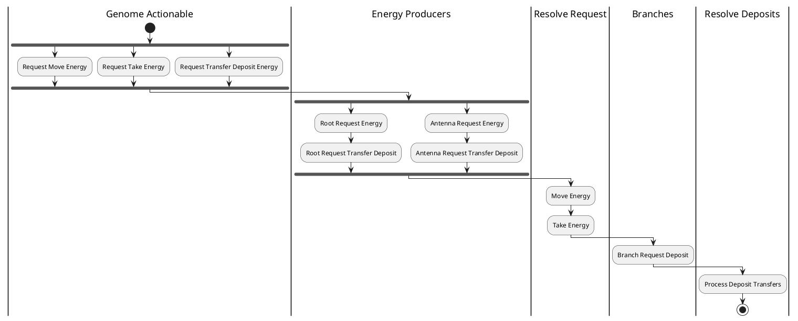

```plantuml
@startuml

|Genome Actionable|
start

fork
    :Request Move Energy;
fork again
    :Request Take Energy;
fork again
    :Request Transfer Deposit Energy;
end fork

|Energy Producers|

fork
    :Root Request Energy;
    :Root Request Transfer Deposit;
fork again
    :Antenna Request Energy;
    :Antenna Request Transfer Deposit;
end fork

|Resolve Request|

:Move Energy;
:Take Energy;

|Branches|

:Branch Request Deposit;

|Resolve Deposits|

:Process Deposit Transfers;

stop
@enduml
```
